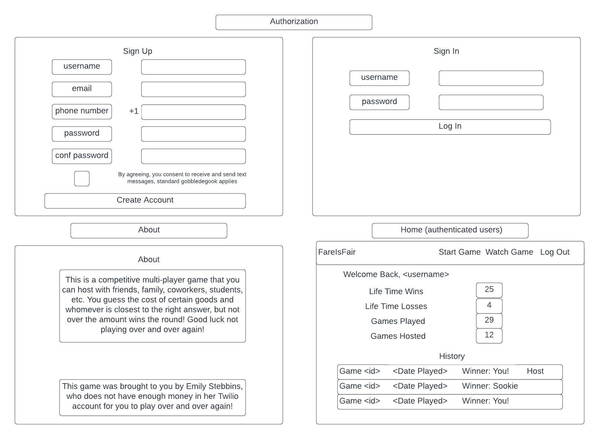
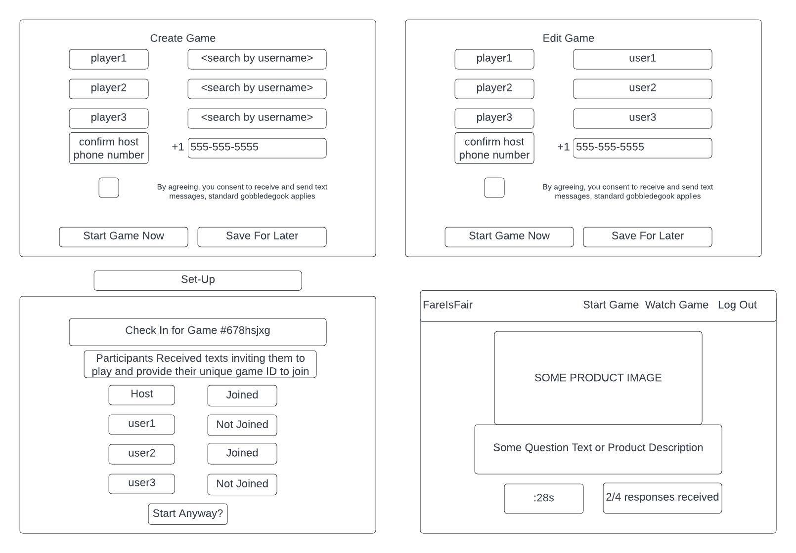
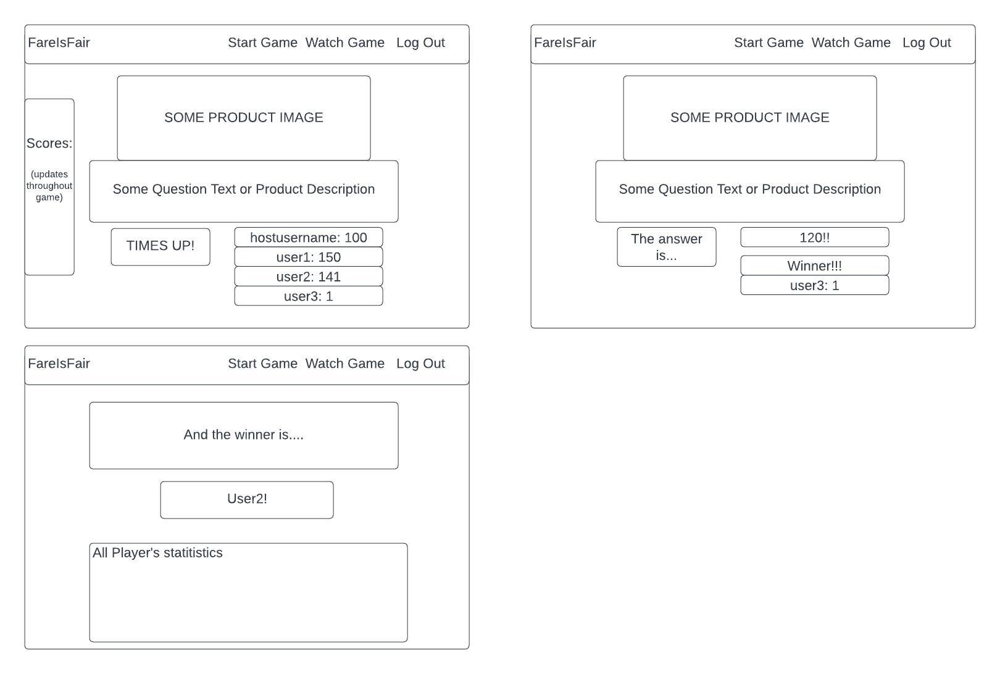
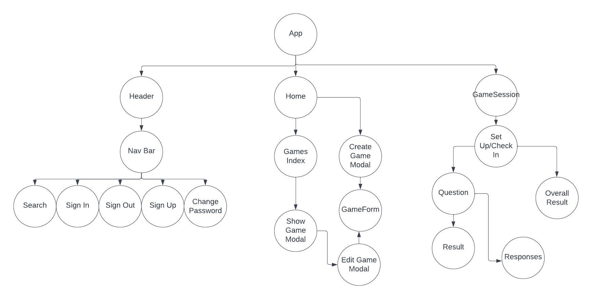

# Fare Is Fair
## Full-stack Application Project
==link to live site==
Front end client consuming Django API at https://github.com/estebbins/FareIsFair-API 

## Overview
This is a full-stack application using Django for the backend and React for the front end (DR stack). This is an interactive group game experience, where users can host and participate in a fun game guessing the cost of products using just their browser, and doing what we all love to do - text the answer! 

### Technologies Used:
- Django
- React (boilerplate [^5])
- Python (D)
- Javascript (R)
- pipenv
- SQL
- twilio https://www.twilio.com 
- Axios?
- Possibly API for game data
- ngrok for sms -> twilio -> http testing during development
- Other Packages/dependencies: django-rest-auth django-cors-headers python-dotenv dj-database-url twilio
- https://djecrety.ir Django Key generator

## User stories
**As a user (AAU), I want the ability to** 
- Read an about page explaining the app/game without having an account
- Create an account with username, password, phone number, and e-mail
- Sign into my account
### Authenticated Users:
- Logout of my account
- Change my phone number
- Host a game that only people I have invited can participate in
- Invite up to 3 other particpants by looking up their username
- Remove or edit participants
- Participate in a game hosted by another user via text
- Choose length of game - 
- Receive a text inviting me to the game
- See the game's prompts in my browser
- Respond to game prompts via SMS
- See how much time is left to answer a question
- View the participants scores as they are updated
- See the overall winner
- See my game history records (how many games hosted, participated in, scores)

### Version 2 or Stretch Goals User Stories
- Customize game
- Expand # of users
- Choose how to interact (Host game but not participating, answer in browser)
- Winner goes to final round

## Wireframes/Screenshots

## Component Diagram

**Image & Icon sources**

[^5]: https://git.generalassemb.ly/sei-ec-remote/react-auth-boilerplate